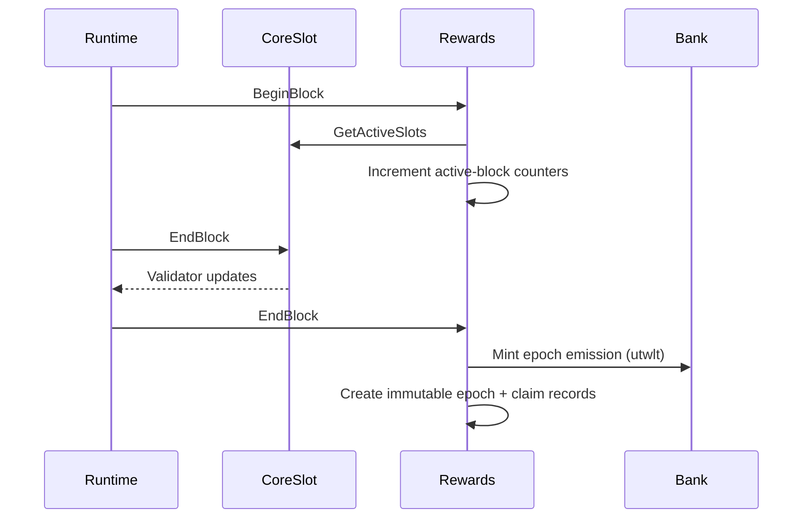

# Chain Architecture

Twilight is a [Cosmos SDK](https://docs.cosmos.network/) application chain running
on CometBFT consensus. It is deliberately minimal: a **Proof-of-Authority (PoA)**
validator model owned by `x/coreslot`, plus a scheduled-emission rewards module
`x/rewards`. The standard `staking`, `distribution`, `slashing`, `governance`,
and `mint` modules are **omitted**.

## Module map

| Module | Role |
|---|---|
| `x/coreslot` | Owns the validator/operator slot set; the **only** module that emits validator updates. Stores each slot's operator address, payout address, reward weight, and status. Exposes a read-only interface to rewards. |
| `x/rewards` | Reads the active CoreSlot set, counts active blocks per epoch, finalizes epochs, mints `utwlt`, creates claim records, and pays snapshotted payout addresses. Does **not** manage validators. |
| `auth`, `bank`, `consensus` | Standard Cosmos SDK modules (accounts, balances/supply, consensus params). |

The runtime is wired via Cosmos SDK `depinject`; CoreSlot and rewards keepers are
constructed manually in `app/app.go`, and module accounts + lifecycle order are
declared in `app/config.go`.

## Consensus and lifecycle interfaces

This is the single most important architectural fact for anyone reasoning about consensus safety:

- **CoreSlot uses the legacy ABCI EndBlock** interface
  (`module.HasABCIEndBlock`) and is the **sole emitter of validator updates**.
- **Rewards uses the modern `appmodule` lifecycle** interfaces
  (`appmodule.HasBeginBlocker` / `HasEndBlocker`), which return **only an error**
  and can never return validator updates.
- Lifecycle order (set in `app/config.go`):
  - **BeginBlock:** `["rewards"]` (CoreSlot has no BeginBlocker).
  - **EndBlock:** `["coreslot", "rewards"]` — CoreSlot runs first so the
    validator set is resolved before rewards finalizes accounting.

## Module boundaries

Rewards depends on CoreSlot, never the reverse:

- Rewards reads only `GetActiveSlots`, `GetSlot`, `GetRewardWeight`,
  `GetAuthority`, and `GetEmergencyAuthority` from CoreSlot — a narrow,
  read-only contract. It never writes CoreSlot state and never reads consensus
  power for accounting.
- CoreSlot has no knowledge of rewards.

Because staking/distribution/slashing/governance are absent, there is no
delegation, no proposer reward, no slashing penalty, and no on-chain governance
proposal flow. Validator authority and emergency authority are CoreSlot concepts
(see [Consensus & CoreSlot](consensus-and-coreslot.md)).

## Where things live

| Path | Contents |
|---|---|
| `app/` | App wiring (`app.go`), module/account config (`config.go`), params (`params/`). |
| `x/coreslot/` | CoreSlot module (PoA validator authority). |
| `x/rewards/` | Rewards module (emission, epochs, claims, params, invariants). |
| `cmd/twilightd/` | The `twilightd` node + CLI binary. |
| `scripts/localnet/` | Localnet init/start/agree/stop + smoke, soak, and drill scripts. |
