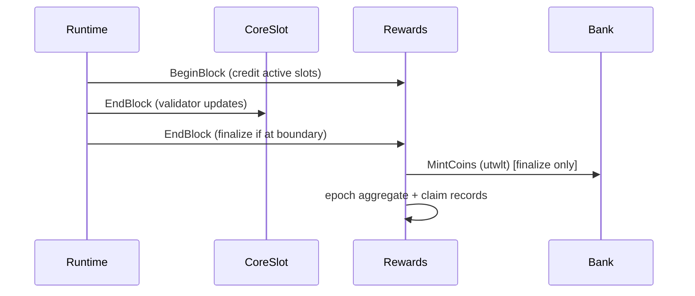

# Block Lifecycle

How a block flows through the modules. The order is fixed in `app/config.go`.

## BeginBlock — `["rewards"]`

CoreSlot has no BeginBlocker. The rewards `BeginBlock`:

1. loads `RewardsState` and the current epoch config;
2. reads the active CoreSlot set (`GetActiveSlots`);
3. validates every returned slot is active (fail-closed on a contract violation);
4. increments the `(current_epoch, slot)` active-block counter for each.

Pause flags do not stop active-block counting — even with settlement, emissions,
or claims paused, counting continues.

## Transaction processing

Standard Cosmos message handling. Rewards messages
([transactions](../rewards/transactions.md)) and CoreSlot lifecycle messages are
processed here; authority checks live in the message servers.

## EndBlock — `["coreslot", "rewards"]`

CoreSlot runs first and is the **sole validator-update emitter**; it resolves the
validator set for the block. Then rewards `EndBlock`:

1. loads state, current epoch config, and params;
2. checks whether the configured epoch boundary is reached and settlement is
   enabled — if not, returns without finalizing;
3. otherwise **finalizes the epoch** in an atomic cache context: mint → pool →
   allocate → write epoch aggregate + claim records → advance carry, cumulative
   emitted, epoch number, and the next epoch config (activating any pending
   params).

## Fail-closed

If any rewards `BeginBlock`/`EndBlock` step errors, the error propagates through
`FinalizeBlock` and the **block does not commit** — no partial state. See
[Security & Failure Modes](../rewards/security-and-failure-modes.md).

## Epoch boundary

The configured end height is
`current_epoch_start_height + epoch_length_blocks − 1` using the **current epoch
snapshot's** length (not the latest params). The current epoch always settles
under its own snapshot; queued params apply to the next epoch. See
[Epoch Lifecycle](../rewards/epoch-lifecycle.md).
