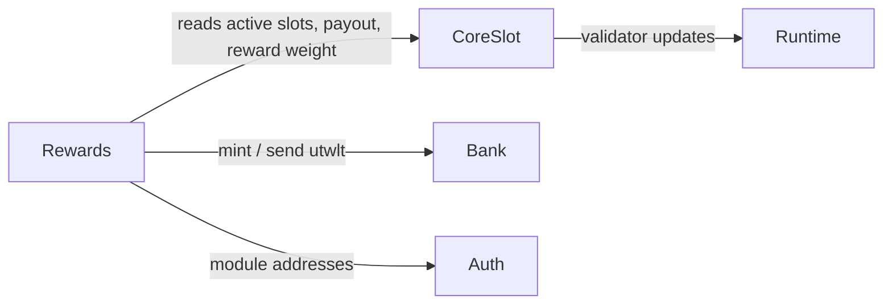

# Module Map

The runtime modules and how they relate. Full architecture in
[Chain → Architecture](../chain/architecture.md).

## Modules in the app

| Module | Lifecycle interface | Emits validator updates? |
|---|---|---|
| `auth`, `bank`, `consensus` | standard | no |
| `x/coreslot` | **legacy** `module.HasABCIEndBlock` | **yes** (sole emitter) |
| `x/rewards` | **modern** `appmodule.HasBeginBlocker` / `HasEndBlocker` | no |

Omitted: `staking`, `distribution`, `slashing`, `governance`, `mint`.

## Dependencies

- Rewards depends on CoreSlot (read-only), bank, and auth. CoreSlot does **not**
  depend on rewards.
- The rewards keeper takes interface-typed dependencies (`AccountKeeper`,
  `BankKeeper`, `CoreSlotKeeper`) — no concrete app imports, no cycles.

## Lifecycle order (`app/config.go`)

| Hook | Order |
|---|---|
| `BeginBlockers` | `["rewards"]` |
| `EndBlockers` | `["coreslot", "rewards"]` |
| `InitGenesis` | `["auth", "bank", "consensus", "coreslot", "rewards"]` |

CoreSlot runs before rewards at EndBlock and remains the only validator-update
emitter. Rewards uses modern error-only lifecycle methods. See
[Block Lifecycle](../chain/lifecycle.md).

## CoreSlot read interface

Rewards consumes exactly five read methods from CoreSlot:
`GetActiveSlots`, `GetSlot`, `GetRewardWeight`, `GetAuthority`,
`GetEmergencyAuthority`. This is the entire surface between the two modules.
