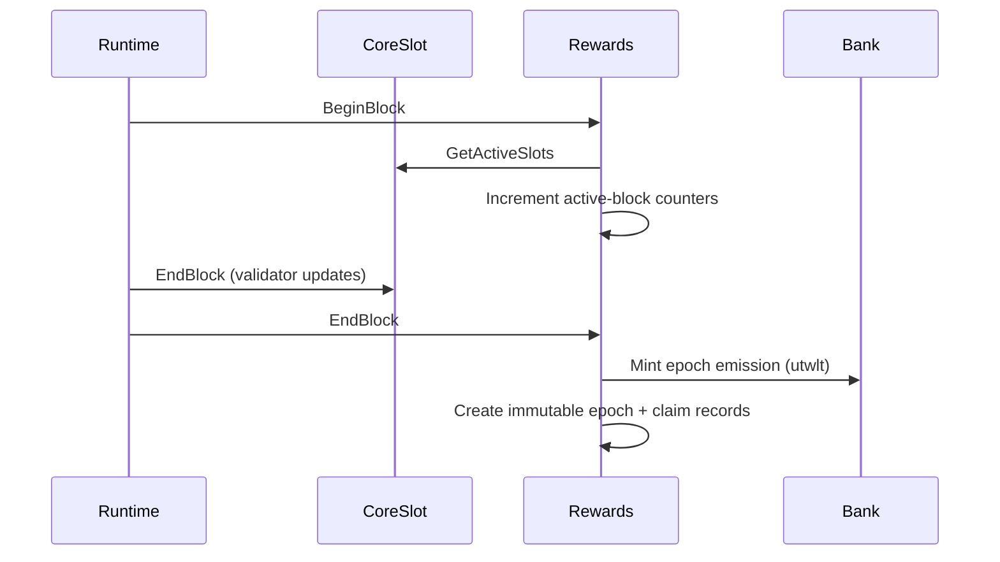

import { constants } from '@site/docs/_snippets/constants.mdx';

# Rewards Overview

`x/rewards` mints scheduled `{constants.nativeDenom}` block rewards, allocates
each epoch's reward pool by active-block participation, and lets finalized rewards
be claimed to each operator's snapshotted payout address. It depends on CoreSlot
for the active operator set but **never** manages validators itself.

## High-level lifecycle

1. **BeginBlock** — for each currently-active CoreSlot, the module increments an
   active-block counter for the open epoch. (CoreSlot owns the active set;
   rewards only reads it.)
2. **EndBlock** — when the configured epoch boundary is reached, the module
   finalizes the epoch: it mints the clipped block emission, builds the reward
   pool (emission + carry-in − treasury), allocates it across operators by
   active blocks, writes an immutable epoch aggregate plus per-operator claim
   records, advances the carry-forward remainder and cumulative emitted, and
   opens the next epoch.
3. **Claim** — anyone may submit a claim transaction for a slot's finalized
   rewards; funds always go to the **snapshotted payout address**, not the
   transaction signer.

## Key parameters (production defaults)

| Parameter | Default |
|---|---|
| Native denom | `{constants.nativeDenom}` |
| Max supply | {constants.maxSupply} |
| Initial block subsidy | {constants.initialBlockSubsidy} |
| Epoch length | {constants.epochLengthBlocks} blocks |
| Distribution mode | `{constants.distributionMode}` |
| Remainder policy | `{constants.remainderPolicy}` |

Values are sourced from `x/rewards/types/defaults.go`. Localnet/test profiles may
override the epoch length; such values are always labeled as test settings.

## Dependencies

- **CoreSlot** (`x/coreslot`) — provides the active operator set, each slot's
  operator/payout addresses, and reward weights (metadata only — no payout effect
  in v1). Rewards reads these through a narrow read-only interface; payout is by
  active-block participation.
- **Module accounts** — `{constants.rewardsModuleAccount}` (the `Minter`,
  holding minted emission and unclaimed rewards) and
  `{constants.feePoolModuleAccount}` (dormant fee plumbing, no permissions).
- **Bank** — mints `{constants.nativeDenom}` into the rewards account and sends
  claims from it.

## Authority model

- **Params updates** are authorized by the CoreSlot **authority** and queued to
  activate at the next epoch boundary.
- **Pause / resume** of emissions, settlement, or claims is authorized by the
  CoreSlot **emergency authority** and takes effect immediately.
- Rewards `Params` store **no** authority of their own — both are read from
  CoreSlot.

## What rewards intentionally does not do

- No staking, delegation, or proposer rewards.
- No validator updates and no modification of the CoreSlot validator set.
- No use of the staking / distribution / slashing / governance modules.
- No fee collection or fee distribution in the current version (fee plumbing is
  present but dormant and disabled).
